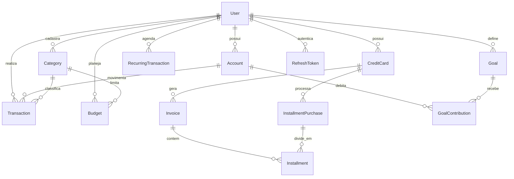

# Arquitetura do Sistema — FinControl

O **FinControl** adota os princípios de **Clean Architecture** (Arquitetura Limpa) e **Domain-Driven Design** (DDD) em um Monólito Modular desacoplado. O objetivo primordial da arquitetura é manter as regras financeiras puras, determinísticas e 100% isoladas de frameworks de apresentação (Fastify) e ferramentas de persistência (Prisma/SQLite).

---

## 1. Diagrama de Camadas & Fluxo de Dependências

```text
┌─────────────────────────────────────────────────────────────────┐
│               Interface do Usuário (React 19 SPA)                │
│         Tailwind CSS · Lucide Icons · Zustand · Axios           │
└────────────────────────────────┬────────────────────────────────┘
                                 │ HTTP / JSON REST + Cookies
┌────────────────────────────────▼────────────────────────────────┐
│               Camada de Apresentação (Fastify)                  │
│       Routes · Controllers · Zod Schemas · Swagger OpenAPI      │
│       Middlewares (JWT Auth, Anti-IDOR, CORS, Rate Limit)       │
└────────────────────────────────┬────────────────────────────────┘
                                 │
┌────────────────────────────────▼────────────────────────────────┐
│                Camada de Aplicação (Use Cases)                  │
│     CreateTransaction · CardInvoiceEngine · RecurringEngine     │
│     SetBudget · ContributeGoal · GetMonthlyReport · ExportCSV    │
└────────────────────────────────┬────────────────────────────────┘
                                 │
┌────────────────────────────────▼────────────────────────────────┐
│                     Domínio Puro (Domain Core)                  │
│       Value Object Money (Zero-Float, centavos inteiros)        │
│       BalanceCalculator (Patrimônio Líquido, Saldos)            │
│       Regras Contábeis Invariantes (Sem duplicação de gastos)   │
└────────────────────────────────┬────────────────────────────────┘
                                 │
┌────────────────────────────────▼────────────────────────────────┐
│                 Camada de Infraestrutura                        │
│          Prisma ORM · SQLite Database · Bcrypt · JWT            │
└─────────────────────────────────────────────────────────────────┘
```

---

## 2. Invariantes Financeiras e Motores de Domínio

### 2.1 Aritmética de Centavos Inteiros: Value Object `Money`
- Todas as quantias monetárias são representadas por inteiros de 64 bits (`BigInt`).
- Proibição estrita de tipos `float` ou `double` no domínio, na API e no banco.
- Métodos utilitários imutáveis: `add()`, `subtract()`, `multiply()`, `percentage()`, `formatBRL()`.

### 2.2 Motor de Cartões & Faturas (`CardInvoiceEngine`)
- **Ciclo de Fechamento & Vencimento**: Calcula automaticamente a fatura correta com base no dia de corte (`closingDay`) e dia de vencimento (`dueDay`).
- **Parcelamento com Absorção de Resto**:
  Quando uma compra no valor $V$ é parcelada em $N$ vezes, a parcela base é dada por:
  $$\text{parcelaBase} = \lfloor V / N \rfloor$$
  $$\text{resto} = V \pmod N$$
  A primeira parcela absorve o resto ($\text{primeiraParcela} = \text{parcelaBase} + \text{resto}$), garantindo que a soma de todas as parcelas seja matematicamente idêntica ao total da compra sem criar ou destruir nenhum centavo.
- **Não-Duplicação de Despesa na Quitação**:
  As compras no cartão são contabilizadas como despesas na competência ou fatura de consumo. O pagamento da fatura (`INVOICE_PAYMENT`) é uma operação de liquidação de passivo entre uma conta corrente e a fatura, **nunca** sendo contabilizado como despesa de consumo no DRE.

### 2.3 Motor de Recorrências (`RecurringEngine`)
- Suporte a frequências: Diária (`DAILY`), Semanal (`WEEKLY`), Mensal (`MONTHLY`), Anual (`YEARLY`).
- Projeção de fluxo de caixa em horizonte de **60 dias** para previsibilidade orçamentária do usuário.
- Materialização idempotente: garante que execuções repetidas não gerem duplicidade de transações programadas.

### 2.4 Demonstrativo de Resultado Pessoal (DRE Mensal)
- Total de Receitas Operacionais (`INCOME`).
- Total de Despesas de Consumo (`EXPENSE`), incluindo parcelas e compras diretas.
- Exclusão estrita de Transferências (`TRANSFER`) e Pagamentos de Fatura (`INVOICE_PAYMENT`).
- Balanço Operacional Líquido: $\text{Receitas} - \text{Despesas}$.
- Taxa de Poupança (*Savings Rate*):
  $$\text{Taxa} = \left(\frac{\text{Receitas} - \text{Despesas}}{\text{Receitas}}\right) \times 100$$
- Evolução Histórica de 6 meses para acompanhamento de tendência.

---

## 3. Modelo de Entidades e Relacionamentos (ERD)



---

## 4. Otimização de Índices e Performance no Banco de Dados

Para garantir tempo de resposta da API $\le 80\text{ms}$ mesmo com volumes elevados de transações, o esquema do Prisma inclui índices compostos e de chave estrangeira:
- `Transaction`: `@@index([userId, date])`, `@@index([accountId])`, `@@index([cardId])`, `@@index([invoiceId])`
- `Invoice`: `@@unique([cardId, month, year])`, `@@index([userId])`
- `Budget`: `@@unique([userId, categoryId, month, year])`, `@@index([userId])`
- `Account`, `Category`, `CreditCard`, `Goal`, `RecurringTransaction`: `@@index([userId])`
- `RefreshToken`, `PasswordResetToken`: `@@unique([tokenHash])`
